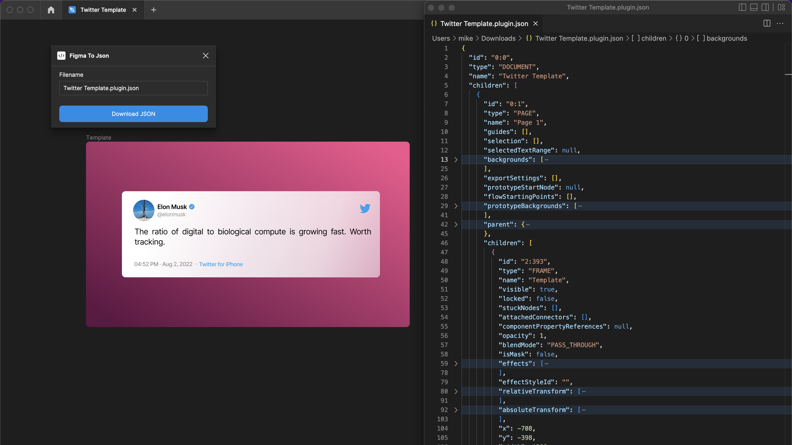

# Figma To JSON 💾

A set of tools to backup Figma files as JSON files that can be read by other design tools or used to automate your workflow.

## Motivation 🤔

Figma has long been our beloved free and open community. On Sep 15, 2022 it was acquired by Adobe and that freedom we enjoyed has been put at risk.

This project aims to protect the open source design and your data by allowing you to export and view it.

## Quick Start ⚡️

### Install the plugin

1. Download the latest release https://github.com/yagudaev/figma-to-json/releases
2. Unzip the file to a folder
3. In the Figma desktop app, open a Figma document.
4. Search for and run `Import plugin from manifest…` via the Quick Actions search bar.
5. Select the manifest you unzipped in step 2

### Usage

https://user-images.githubusercontent.com/1386966/191097407-02263aec-f335-4c3b-92c6-e475cc3b53f1.mp4

1. In the Figma desktop app, open a Figma document.
2. Search for an run `Figma To JSON` via the Quick Actions search bar.
3. Click `Download JSON` and select a folder to download to

Now you can inspect the JSON file with any text editor. We recommend using VS Code.

## Other Formats 📄

### .fig files

Why not use .fig?

Turns out, it is an [opaque and proprietary format](https://forum.figma.com/t/inquiry-about-the-fig-file-format/6351). Figma has no intention of documenting it.

We eventually plan on reverse-engineering and supporting it as well. It will provide the safest backup mechanism, but it is significantly harder to program against.

### Figma REST API

The REST API is developed by a separate team at Figma and contains read-only functionality. This means the [format of the data can differ significantly](https://forum.figma.com/t/need-help-with-gradienttranform-matrix/26792) from that expected by the Plugin API.

In the future we would like to have a way of transforming between the REST API to the Plugin API. This will allow us to pull arbitrary Figma urls without having to open Figma Desktop first.

### SVG Export

SVG is an industry standard, but the spec is very large and each [design editor only implements a subset of it](https://www.figma.com/blog/with-figmas-new-svg-exports-less-more/).

For that reason, when Figma exports to SVG it removes certain metadata. E.g. Text gets converted to a path instead of using the SVG `<Text>` tag. This makes it harder for other design tools to work with.

### OpenDesign

[OpenDesign](http://opendesign.dev/) is an incredible initiative to create a uniform format we can share across design tools. The format is called Octopus. It supports most of the features of Figma, [https://opendesign.dev/docs/design-format-support](https://opendesign.dev/docs/design-format-support).

Parts of the stack like the render are not fully-open source, so sadly we couldn't simply extend their work yet. We hope to chat with their team and see what we can do.

### Penpot

Penpot is a fantastic editor trying to leverage SVG to work across design tools. However as mentioned SVG is not perfect and we need a specialized [import from Figma which is not yet ready](https://github.com/penpot/penpot/issues/2265).

### .sketch

While Figma build an importer for sketch files, the Sketch team has not build an importer for .fig files.

## Contribution

Please feel free to fork the repo and create pull requests. If you find a bug report it, if you have ideas and want to have a discussion use the discussion tab 😁.

## Special Thanks

- Yuan Qing Lim for https://github.com/yuanqing/create-figma-plugin
- Figma Plugin Helper Functions: https://github.com/figma-plugin-helper-functions/figma-plugin-helpers
- Brian Lovin for https://github.com/brianlovin/figma-export-zip

